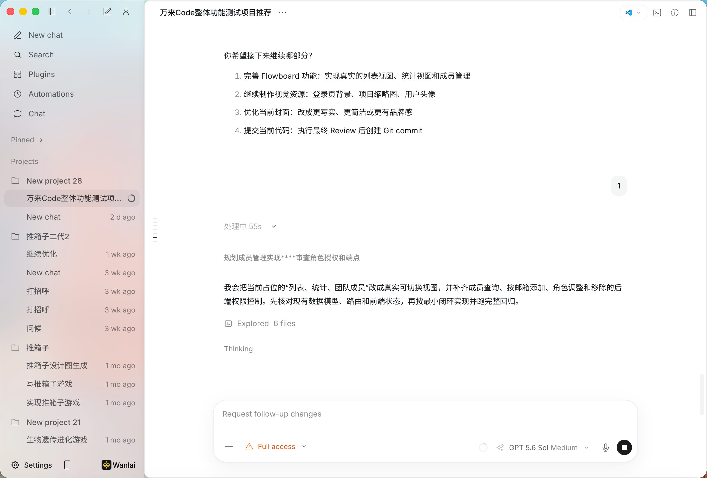

<div align="center">


# WanLai Code

### An open-source Codex AI coding client built on OpenCode

[简体中文](README.md) · [English](README.en.md)

[](https://wanlai.ai)
[](https://github.com/ymquant/WanLaiCode/releases)
[](https://github.com/ymquant/WanLaiCode/issues)
[](LICENSE)

[Website](https://wanlai.ai) ·
[Documentation](https://doc.wanlai.ai/) ·
[Download](https://github.com/ymquant/WanLaiCode/releases) ·
[Feedback](https://github.com/ymquant/WanLaiCode/issues)

</div>



<p align="center"><sub>Conceptual product visual. The actual interface may change between releases.</sub></p>

## Overview

WanLai Code is an open-source Codex AI coding client built on OpenCode. It supports macOS, Windows, Linux, and the command line, helping developers understand code, edit files, run commands, and complete multi-step development tasks in one workspace.

This repository contains the source code for the client, CLI, SDK, plugin interfaces, and public UI so the community can inspect, build, and contribute to the project.

## Highlights

- A desktop client and CLI for common development environments
- AI-assisted code understanding, editing, command execution, and task collaboration
- Extensible SDKs, plugin interfaces, and reusable public UI components
- Automated build and release workflows for macOS, Windows, and Linux

## Open-source scope

This repository focuses on client-side capabilities that can be built and reviewed locally. Accounts, billing, model gateways, enterprise services, the website, and internal deployment infrastructure are outside this repository's open-source scope.

The client can connect to WanLai's hosted services and can also use other compatible services where supported by the code. See [NOTICE.md](NOTICE.md) for the complete scope and upstream attributions.

## Download

Official installers are published through [GitHub Releases](https://github.com/ymquant/WanLaiCode/releases):

| Platform | Packages |
| --- | --- |
| macOS, Apple Silicon / Intel | `.dmg`, `.zip` |
| Windows x64 | `.exe` |
| Linux x64 | `.AppImage`, `.deb`, `.rpm` |

Only packages signed by the project maintainers and published in this repository's Releases are official distributions. Do not install executables shared through pull requests, issues, or third-party file hosts.

## Local development

You need the Bun version declared in `package.json`, plus Node.js, Rust, and the platform-specific desktop packaging toolchain.

```bash
bun install --frozen-lockfile

cd packages/opencode
bun typecheck

cd ../desktop
bun typecheck
bun run build
```

Run tests from the relevant package directory. The repository intentionally prevents running the entire test suite from the repository root.

## Contributing

Before opening a pull request, read [CONTRIBUTING.md](CONTRIBUTING.md) and [SECURITY.md](SECURITY.md). Code from forks runs only on GitHub-hosted runners without access to secrets; official releases use a separate protected workflow.

If you discover a security issue, report it privately through the channel documented in [SECURITY.md](SECURITY.md) instead of opening a public issue.

## License and upstream projects

WanLai Code is available under the [MIT License](LICENSE). It includes modified code based on OpenCode and other open-source projects. See [NOTICE.md](NOTICE.md) and the licenses of individual dependencies for details.
