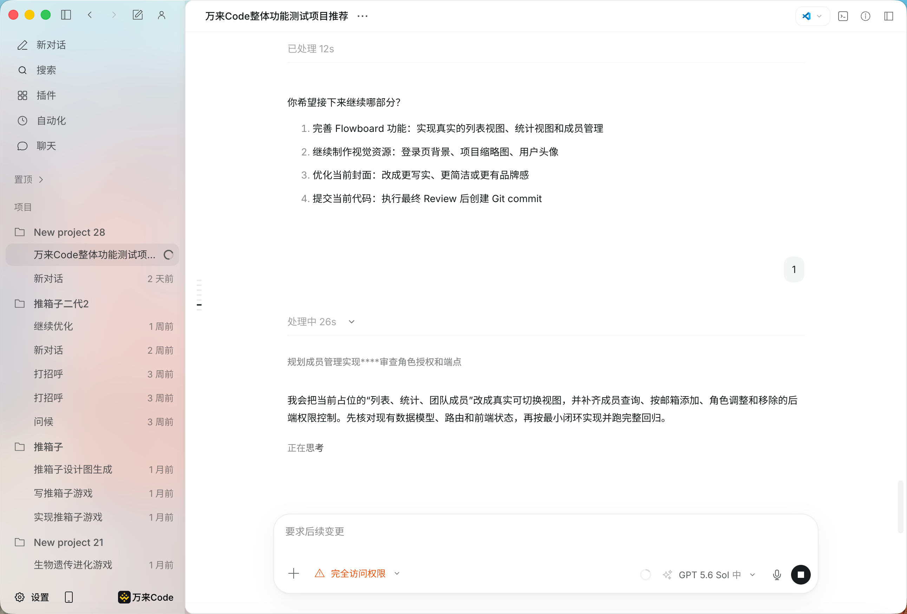

<div align="center">


# 万来 Code

### 不只回答代码问题，而是持续把开发任务做完

基于 OpenCode 构建 · Codex 风格交互 · 桌面端 / CLI · macOS / Windows / Linux

[简体中文](README.md) · [English](README.en.md)

[官网](https://wanlai.ai) ·
[文档](https://doc.wanlai.ai/) ·
[下载](https://github.com/ymquant/WanLaiCode/releases) ·
[参与贡献](CONTRIBUTING.md) ·
[问题反馈](https://github.com/ymquant/WanLaiCode/issues)

</div>



<p align="center"><sub>概念产品视觉图，实际界面可能随版本更新而变化。</sub></p>

## 项目介绍

万来 Code（WanLai Code）是一款基于 OpenCode 构建、面向真实开发流程的开源 AI 编程客户端。它不仅能解释代码，还能读取项目、编辑文件、运行命令、调用工具，并围绕一个目标持续推进多步骤任务。

我们在 OpenCode 的代理内核之上，重点补充了更完整的桌面工作空间和 Codex 风格交互：开发者可以在任务运行时追加要求，用目标模式让 Agent 自主续跑，用自动化定时执行重复工作，并通过插件、技能、MCP、项目记忆和远程控制扩展工作流。

本仓库公开客户端、CLI、SDK、插件接口和公共 UI 的源码，方便社区审阅、构建和参与开发。

## 核心体验

| 能力 | 解决的问题 | 适合场景 |
| --- | --- | --- |
| 目标模式 | Agent 围绕目标继续检查、实现和验证，无需反复发送“继续” | 跨文件改动、完整功能、长时间任务 |
| 运行中追加要求 | 任务执行期间直接补充或修正要求，保留已完成的工具结果和上下文 | 需求调整、Review 意见、临时约束 |
| 自动化任务 | 保存提示词与执行计划，按时运行并保留结果 | 代码检查、日报、仓库维护 |
| 插件、技能与 MCP | 在客户端内管理扩展，把团队工具和专用流程接入 Agent | 团队规范、内部工具、重复工作流 |
| 全局与项目记忆 | 按需复用偏好和项目经验，减少重复说明 | 长期项目、多人协作、跨会话开发 |
| 远程控制 | 从其他设备查看桌面端任务状态并继续推进 | 构建、测试和长时间运行任务 |

## 与 OpenCode 有什么不同

万来 Code 不是对 OpenCode 简单换皮。它保留 OpenCode 的开源代理能力，同时沿着“桌面工作空间 + Codex 交互 + 可持续任务”继续开发。

| 对比维度 | OpenCode 上游侧重点 | 万来 Code 的扩展 |
| --- | --- | --- |
| 交互方式 | 通用开源编码 Agent 与终端工作流 | Codex 风格桌面会话、运行中引导、回复阶段与工具过程展示 |
| 长任务 | 由用户持续发起和跟进任务 | 目标模式自主续跑，并提供暂停、恢复和目标状态管理 |
| 重复工作 | 通过命令或外部系统组织 | 客户端内置定时自动化、运行记录和结果通知 |
| 扩展管理 | 提供插件、工具和 Provider 基础能力 | 增加可视化插件市场、技能管理和 MCP 管理入口 |
| 上下文复用 | 依赖项目文件与会话上下文 | 增加全局/项目两级记忆，并支持按需读取与管理 |
| 使用场景 | 以本地编码 Agent 为核心 | 桌面端、CLI、SDK 与远程控制协同，面向持续开发工作流 |
| 在线服务 | 可连接不同模型服务 | 可选万来在线服务，也可使用代码已经支持的兼容服务 |

> 对比基于本仓库当前实现与 OpenCode 的上游定位，双方都会持续演进。万来 Code 尊重并保留上游许可证和署名，详见 [NOTICE.md](NOTICE.md)。

## 一次任务可以这样完成

1. 打开本地项目，描述最终目标，而不只是询问某一段代码。
2. Agent 搜索代码、编辑文件、运行命令，并把推理阶段、工具调用和改动结果呈现在同一会话中。
3. 执行过程中直接追加新要求；系统会把它归入当前任务，而不是丢到无关的新对话。
4. 开启目标模式后，Agent 会继续检查遗漏并运行验证，直到目标完成、需要确认或被暂停。
5. 对重复工作创建自动化；对长任务可通过远程控制查看和继续处理。

## 核心能力一览

- **完整开发闭环**：理解代码、搜索文件、编辑内容、执行命令、查看差异并完成验证
- **多项目桌面工作空间**：在项目、会话、文件、终端和任务结果之间切换
- **可控 Agent**：权限模式、运行中引导、暂停/恢复、目标状态与工具过程可见
- **多模型与 Provider**：使用项目内已经支持的模型供应商和兼容服务
- **扩展体系**：SDK、插件、技能、MCP 与公共 UI 组件
- **跨平台发行**：macOS、Windows、Linux 桌面安装包及 CLI

## 开源范围

本仓库聚焦可在本地构建和审阅的客户端能力。账号、计费、模型网关、企业服务、官网和内部部署基础设施不属于本仓库的开源范围。

客户端可以连接万来提供的在线服务，也可以按代码中已有能力配置其他兼容服务。完整的开源边界与上游声明见 [NOTICE.md](NOTICE.md)。

## 下载

正式安装包统一通过 [GitHub Releases](https://github.com/ymquant/WanLaiCode/releases) 发布：

| 平台 | 安装包 |
| --- | --- |
| macOS Apple Silicon / Intel | `.dmg`、`.zip` |
| Windows x64 | `.exe` |
| Linux x64 | `.AppImage`、`.deb`、`.rpm` |

只有经过项目维护者签名并出现在本仓库 Releases 中的安装包才是官方发行版。不要安装 PR、Issue 或第三方网盘提供的可执行文件。

## 本地开发

需要仓库 `package.json` 指定版本的 Bun，以及 Node.js、Rust 和各平台桌面打包工具链。

```bash
bun install --frozen-lockfile

cd packages/opencode
bun typecheck

cd ../desktop
bun typecheck
bun run build
```

测试必须从具体 package 目录运行，禁止从仓库根目录运行整仓测试。

## 参与贡献

提交 PR 前请阅读 [CONTRIBUTING.md](CONTRIBUTING.md) 和 [SECURITY.md](SECURITY.md)。来自 fork 的代码只会在无 Secret 的 GitHub-hosted runner 上执行；正式发版由受保护的独立流程完成。

如果你发现安全问题，请按 [SECURITY.md](SECURITY.md) 中的私密渠道报告，不要创建公开 Issue。

### 贡献者支持

我们欢迎长期维护、功能开发、Bug 修复、测试、文档和本地化贡献。对于需求明确、能够合并并持续维护的贡献，项目会根据工作范围、实现质量和实际影响提供开发补贴；具体金额与交付范围请在开始开发前确认。

| 贡献方向 | 示例 | 可提供的支持 |
| --- | --- | --- |
| 功能与体验 | Agent 工作流、桌面体验、跨平台能力 | 需求梳理、代码 Review、开发补贴 |
| 稳定性与安全 | Bug 修复、测试、依赖与供应链安全 | 复现环境、技术协作、开发补贴 |
| 文档与社区 | 使用文档、教程、本地化、社区答疑 | 内容 Review、署名与贡献记录 |

有意参与可先创建 [GitHub Issue](https://github.com/ymquant/WanLaiCode/issues) 说明计划，也可以通过[万来官网](https://wanlai.ai)联系项目团队，获取微信或 Telegram 社区入口。请勿在公开 Issue 中留下私人联系方式。

## 开源许可与上游声明

项目采用 [MIT License](LICENSE)。本项目包含基于 OpenCode 及其他开源项目修改的代码，详情见 [NOTICE.md](NOTICE.md) 和各依赖自身的许可证。
